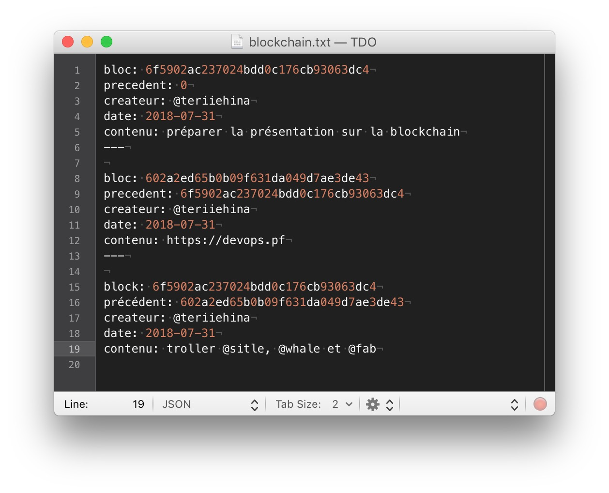

autoscale: true
footer: TDO - S01E08
slidenumbers: true
theme: Next, 1

# TDO - S01E08

## La blockchain

### mercredi 1er août @ Prism

<!-- ---

> Je vous écris une longue lettre parce que je n’ai pas le temps d’en écrire une courte
-- Blaise Pascal -->

---

## Merci

  - au PRISM de nous accueillir
  - à la CCISM d'avoir créé le Prism
  - à vous d'être venu
  
---

## TahitiDevOps

  - petite association
  - envie de partager le savoir
  - vous êtes les bienvenues à proposer ou présenter des sujets
  - cette prez et toutes les précédentes sont disponible sur [https://devops.pf](https://devops.pf)

---

### shameless plug

#[https://arioi.pf](https:arioi.pf)

---

## Sondage
[.build-lists: true]

  - qui utilise (au moins) une cryptomonnaie ?
  - qui connait la blockchain ?
  - qui a déjà entendu parler de la blockchain ?
  - qui n'y connait rien du tout ?
  - qui se sert d'un levier de vitesse ?
  - qui sait comment fonctionne un levier de vitesse ?

---

## Objectifs

  - vous familiariser avec le concept de la blockchain, des cryptomonnaies et des smart contracts
  - vous donner une grille de lecture sur l'intérêt de la blockchain
  - vous permette de faire la part des choses

---

## Le menu

  - motivation, peer-to-peer, hashing
  - la blockchain
  - les cryptomonnaies
  - les smart contracts
  - attaque des 51%

---

## Motivation

  - 2008 : crise de confiance
  - 2009 : «Satoshi Nakamoto» propose le bitcoin, qui s'appuie sur un mécanisme de blockchain
  - l'idée est de pouvoir faire des transactions de pair à pair, sans passer par une autorité centrale
  - i.e. décentraliser la confiance

---

## Peer-to-peer, aka distribué

  - napster, bittorrent
  - plusieurs entités possède la "vérité"
  - si une entité manque, ment ou fait erreur, on peut s'appuyer sur les autres
  
---

## Un tout petit peu de technique

Une fonction de hachage:

  - prend un document en entrée (un film de 3Go, un fichier Word de 2Mo)
  - donne en sortie une empreinte, i.e. une chaîne de caractère de longueur fixe
  - il existe plusieurs fonction de hachage  
  
---

## La blockchain

---

## En 5 points

  - un registre
  - public
  - distribué
  - duquel on ne peut rien retirer
  - dont la modification obéit à certaines règles

---

## une blockchain "simple"...

  - c'est un fichier qui contient une liste de block
  - chaque bloc contient:
      - son identifiant unique
      - l'identifiant du bloc auquel il se rattache
      - le contenu à proprement parler

---

---

---

## ... mais pas simpliste

  - d'où vient le premier bloc ?
  - comment trouver le bloc précédent auquel se rattacher ?
  - qui décide quel bloc est attaché à la blockchain ?
  - comment être informé qu'un nouveau block vient d'être attaché ?
  - qui décide du contenu d'un bloc ?

---

## Besoin d'un protocole...

Le protocole spécifie (entre autre):
 
  - le calcul de l'identifiant d'un bloc
  - comment remplir un bloc
  - comment attacher un bloc au bout de la chaine
  - comment communiquer avec les autres «utilisateurs» de la chaine

--- 
## ... et de clients

  - un client d'une blockchain est un logiciel implémentant le protocole de la blockchain et pouvant donc interagir avec cette dernière
  - un client peut donc être utilisé depuis un ordinateur, un téléphone ou un objet connecté

---

## La blockchain n'est qu'un concept. 

---

### Une blockchain est définie par un protocole et est manipulée via des clients.

<!-- ---

## Résumons

~~La~~ Une blockchain, c'est:

  - un gros fichier texte
  - définit par un protocole
  - lu, modifié et échangé par des **clients** (i.e. des logiciels implémentant le protocole) -->

---

### Ce que la blockchain permet

  - partager de l'information
  - garantir l'intégrité de l'information sans autorité centrale
  - créer de la confiance entre personnes (ou objets) qui ne se connaissent pas

---

### Pour comprendre une blockchain

  - qui peut créer des blocs ?
  - que contiennent ces blocs ?
  - comment décide-t-on de quel bloc est rattaché ?

---

## Les cryptomonnaies

---

## Les cryptomonnaies

  - Des devises qui n'existent que dans le monde numérique mais avec un impact réel
  - Silk Road, ransomwares
  - utilisent le concept de blockchain
  - ajoute un élément capital: la «création» de valeur

---

## Pas de rose sans épines

  - volatile, beaucoup de spéculation
  - manque de confiance de la part de Mme et M. tout-le-monde
  - 100% numérique (on perd l'accès au wallet, on perd tout)

---

## Bitcoin 101

Il faut installer un logiciel qui permet de:

  - créer un "wallet" (i.e. un identifiant unique permettant de recevoir et d'envoyer des bitcoins)
  - télécharger la blockchain du Bitcoin (100 Go en janvier 2017)
  - faire des transferts de bitcoins

---

## Comment créer un bitcoin ?

  - récupérer un ensemble de transaction entre pairs
  - y ajouter une transaction s'attribuant un bitcoin
  - résoudre une équation mathématique basé sur ces transactions
  - poster le bloc contenant les transactions et la solution à l'équation pour acceptation par les «membres» de la blockchain
  - si le bloc est accepté, on "gagne" un bitcoin

---

## La blockchain est un concept

  - il existe une foultitude de cryptomonnaies
  
---

## Les smarts contracts

---

## Les smarts contracts

  - un bout de code qui est inséré dans la blockchain, avec des conditions de déclenchement
  - régulièrement, un client scanne le contenu de la blockchain
  - quand le contenu global de la blockchain montre que les conditions du «contrat» (i.e. du code) sont remplies, le code est exécuté et son résultat est stocké dans la blockchain

---

## Exemple de smart contracts : la blockchain (fictive) de Airbnb

  - je loue un appartement sur Airbnb
    - création d'un contrat: «si Peter paie 1 bitcoin dans une transaction libellée 'A891SL', il accèdera à l'appartement #839038 du 8 au 10 novembre»
  - je fais le paiement via l'application Airbnb qui insère la transaction dans un bloc puis dans la blockchain
  - le 8 novembre, je suis devant la serrure de l'appartement #839038, je présente mon smartphone qui prouve à la serrure que je suis Peter, la serrure scanne la blockchain, voit le contrat, voit que les conditions sont remplies, et donc la serrure s'ouvre

---

## Comment rattacher un bloc

  - lorsqu'un client a créé un bloc, il l'envoie à tous les pairs qu'il connait
  - chaque pair regarde si le bloc est correct et vérifie si le bloc auquel rattacher la demande est effectivement actuellement le dernier bloc de la chaine
  - si oui, le pair accepte le bloc, l'ajoute à sa copie de la chaine et diffuse à ses propres pairs le bloc a accepter ainsi que le fait qu'il a lui-même accepté ce bloc
  - par effet de propagation, le bloc sera accepté

---

## Attaques des 51%

---

## Attaques des 51%

  - le protocole définit sous quelle condition un bloc peut être rattaché à la blockchain
  - la nature distribuée du bloc fait que plusieurs blocs peuvent être acceptés comme bloc suivant de la chaine
  - il est nécessaire de procéder périodiquement à une réconciliation de la blockchain

---

## Attaques des 51%

  - des acteurs malveillants codent leur propre client, compatible avec le protocole de la blockchain, mais utilisant des règles différents pour l'acceptation d'un bloc
  - si ces acteurs malveillants représent plus de 51% de la chaîne, lors de la réconciliation, leur version de la chaîne sera acceptée par les 49% restants
  
---

## Conclusion

---

## Comment "lire" une blockchain ?

  - qui peut créer des blocs ?
    - publique ? privée ? consortium ?
  - que permet de faire le contenu
    - chiffrement ? identification ? authentification ?

---

## #BS

si une blockchain n'est pas ouverte (on ne peut pas y participer avec son propre client), c'est que les propriétés intrinsèques de la blockchain ne sont pas utilisées.

---

## TL;DR

  - la blockchain permet de décentraliser la confiance en un **registre**
  - les cryptomonnaies ajoutent le mécanisme de création de valeur lors de la création d'un bloc
  - les smarts contracts sont des bouts de code qui seront exécutés par un __client__ si les conditions sont remplies __dans la blockchain__
  - une blockchain publique est sujette à l'attaque des 51%

<!-- ---

## Qui décide quel bloc est attaché à la blockchain ? (2/2)

  - si un client reçoit une demande d'ajout de bloc et que sa version de la chaine diffère, il répondra négativement à la demande d'ajout

---

## Propriétés de la blockchain

  - permettre de distribuer la confiance
  - la blockchain est inaltérable
  - la blockchain est distribuée
  - la blockchain est ouverte

---

## Utilisation de la blockchain

  - cryptomonnaies, i.e. le contenu d'un porte-monnaie mais également les transactions entre porte-monnaies
  - smart contracts -->